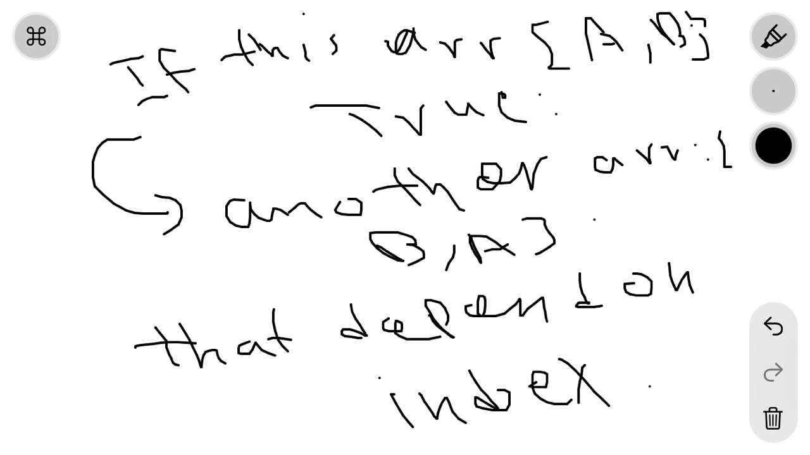

# Reverse an Array
an function with reflected index

## Challenge
I create a function that takes an array and give me the index from the last one and ends with the first one.
## Approach & Efficiency
i just follow the simplest way without use any methods, it toke like one hour.

## Solution
i used if condition to check if the index of any array is in a certain arrangement and if that arrangement is truem then print the reflect index of that array.  

