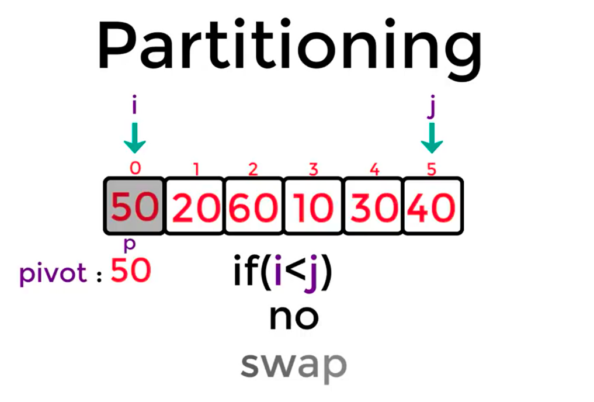
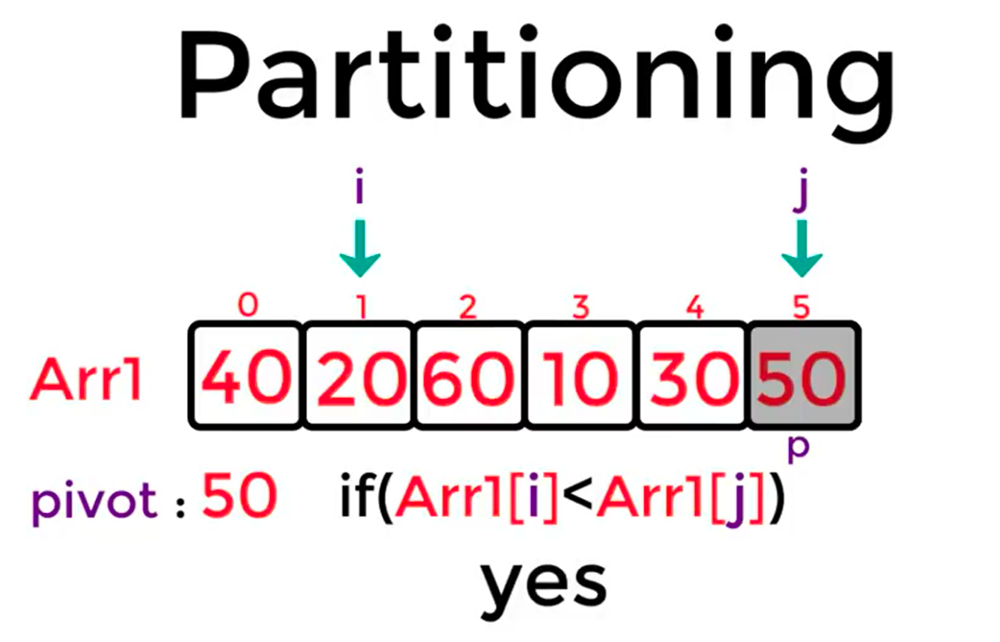
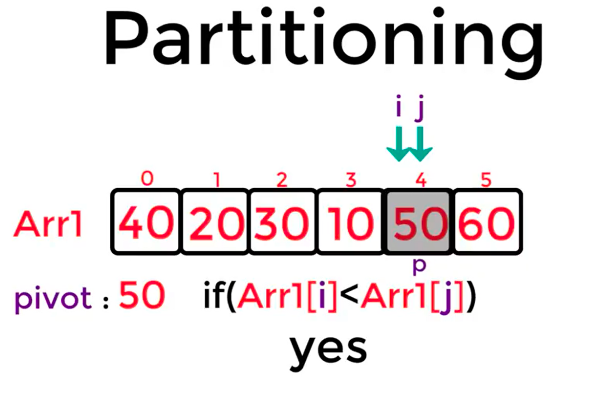
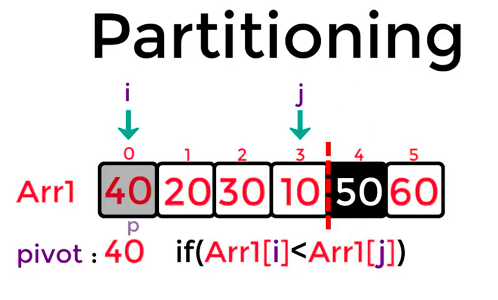
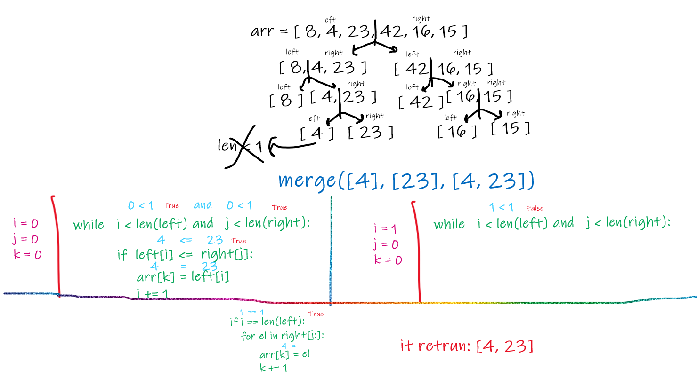
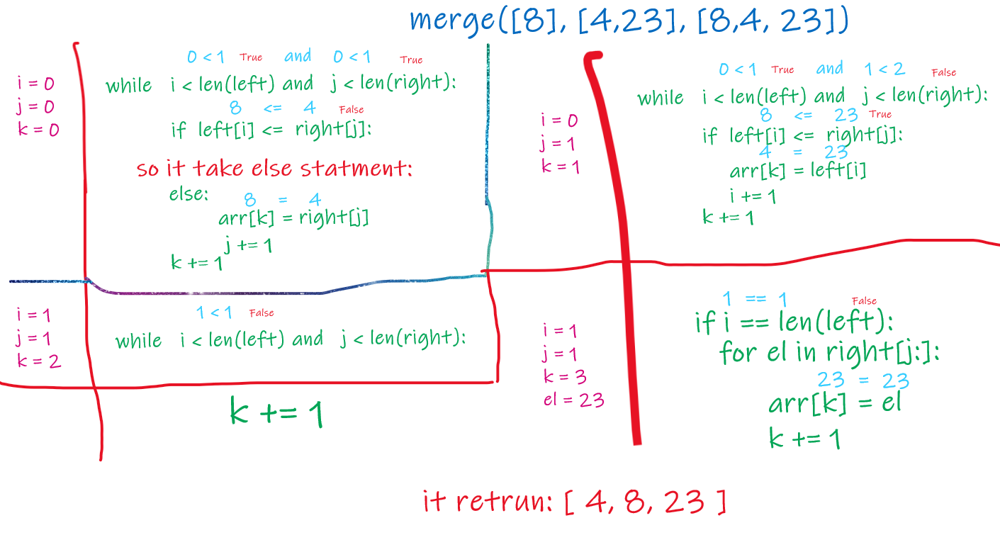
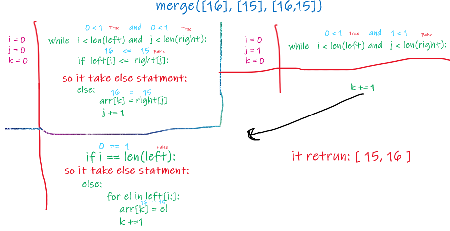
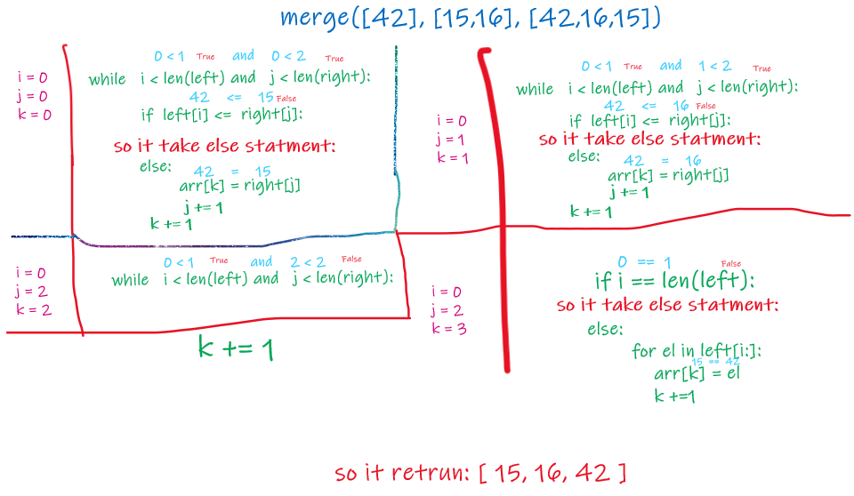
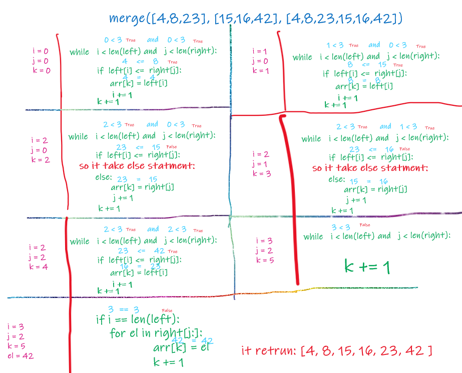

Quick Sort Pseudocode ALGORITHM QuickSort(arr, left, right) if left < right // Partition the array by setting the position of the pivot value DEFINE position <-- Partition(arr, left, right) // Sort the left QuickSort(arr, left, position - 1) // Sort the right QuickSort(arr, position + 1, right)

ALGORITHM Partition(arr, left, right) // set a pivot value as a point of reference DEFINE pivot <-- arr[right] // create a variable to track the largest index of numbers lower than the defined pivot DEFINE low <-- left - 1 for i <- left to right do if arr[i] <= pivot low++ Swap(arr, i, low)

 // place the value of the pivot location in the middle.
 // all numbers smaller than the pivot are on the left, larger on the right.
 Swap(arr, right, low + 1)
// return the pivot index point
 return low + 1
ALGORITHM Swap(arr, i, low) DEFINE temp; temp <-- arr[i] arr[i] <-- arr[low] arr[low] <-- temp Trace Sample array: [50,20,60,10,30,40]

begining: simply it will takes you to kuick sort an array two simple functions:

partioning: witch will keep dividing the array after buting ecah element in own right sort place in the array..

Recursivly: eah divided arry will re partioning.. partioning: by choosing first element to partioning (pivot), then create two pointers to the first element and the last element of the inputed arr, then starting the algorithm:

if pivot < arr[j]:

lets swap betwin them..

if not:

lets movie our second pointer a step forwrd

and finly when 2pointers are equal .. we dvide the array and re partition each with same process untill geting one sorted arry.. 

and simply thats it.. :)

Efficiency Space complexity Big O(log(n))

Time complexity Big O(n^2)
here u can see visualization:

# Merge Sort
Merge sort breaks a list up into the smaller lists than merges the lists back together in order.

Merge sorts a fast but require a big amount of memory.
Merge Sort is useful for sorting linked lists.
Merge Sort is a stable sort which means that the same element in an array maintain their original positions with respect to each other.
To sort a sequence S with n elements using the three divide-and-conquer steps, the merge-sort algorithm proceeds as follows:

Divide: If S has zero or one element, return S immediately; it is already sorted. Otherwise (S has at least two elements), remove all the elements from S and put them into two sequences, S1 and S2, each containing about half of the elements of S; that is, S1 contains the first [n/2] elements of S, and S2 contains the remaining [n/2] elements.

Conquer: Recursively sort sequences S1 and S2.

Combine: Put back the elements into S by merging the sorted sequences S1 and S2 into a sorted sequence.

## Pseudocode
 ALGORITHM Mergesort(arr)
    DECLARE n <-- arr.length

    if n > 1
      DECLARE mid <-- n/2
      DECLARE left <-- arr[0...mid]
      DECLARE right <-- arr[mid...n]
      // sort the left side
      Mergesort(left)
      // sort the right side
      Mergesort(right)
      // merge the sorted left and right sides together
      Merge(left, right, arr)

ALGORITHM Merge(left, right, arr)
    DECLARE i <-- 0
    DECLARE j <-- 0
    DECLARE k <-- 0
    
    while i < left.length && j < right.length
        if left[i] <= right[j]
            arr[k] <-- left[i]
            i <-- i + 1
        else
            arr[k] <-- right[j]
            j <-- j + 1

        k <-- k + 1
    
    if i = left.length
       set remaining entries in arr to remaining values in right
    else
       set remaining entries in Merge Sort
Merge sort breaks a list up into the smaller lists than merges the lists back together in order.

Merge sorts a fast but require a big amount of memory.
Merge Sort is useful for sorting linked lists.
Merge Sort is a stable sort which means that the same element in an array maintain their original positions with respect to each other.
To sort a sequence S with n elements using the three divide-and-conquer steps, the merge-sort algorithm proceeds as follows:

Divide: If S has zero or one element, return S immediately; it is already sorted. Otherwise (S has at least two elements), remove all the elements from S and put them into two sequences, S1 and S2, each containing about half of the elements of S; that is, S1 contains the first [n/2] elements of S, and S2 contains the remaining [n/2] elements.

Conquer: Recursively sort sequences S1 and S2.

Combine: Put back the elements into S by merging the sorted sequences S1 and S2 into a sorted sequence.

Pseudocode
 ALGORITHM Mergesort(arr)
    DECLARE n <-- arr.length

    if n > 1
      DECLARE mid <-- n/2
      DECLARE left <-- arr[0...mid]
      DECLARE right <-- arr[mid...n]
      // sort the left side
      Mergesort(left)
      // sort the right side
      Mergesort(right)
      // merge the sorted left and right sides together
      Merge(left, right, arr)

ALGORITHM Merge(left, right, arr)
    DECLARE i <-- 0
    DECLARE j <-- 0
    DECLARE k <-- 0

    while i < left.length && j < right.length
        if left[i] <= right[j]
            arr[k] <-- left[i]
            i <-- i + 1
        else
            arr[k] <-- right[j]
            j <-- j + 1

        k <-- k + 1

    if i = left.length
       set remaining entries in arr to remaining values in right
    else
       set remaining entries in arr to remaining values in left

Trace
Sample array: [8,4,23,42,16,15]

Pass 1
first it will split the array into two arrays then split each into two arrays until each array length >= 1 , then start with merge first elemnts ([4,23]) with compare betwin and let the lesser become first..

Pass 2
then merge function will move to the bigest ([8,4,23]) array and compare each element and let the lesser first

Pass 3
then merge function will move to the right side of the array and start with last split ([16,15]) then compare each element and let the lesser become first..

Pass 4
then merge function will move to the bigest arry ([42,15,16]) then compare each element and let the lesser become first..

Pass 5
at the last merge function start compare betwin ecah two splits and merge them with letting the less become first..

Sorted array: [4, 8, 15, 16, 23, 42]

___
## Efficiency
Space complexity Big O(n)

