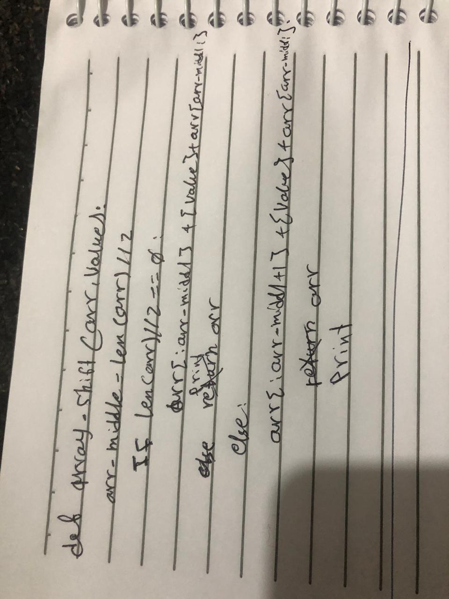

# Shift An Array

## Challenge
create function that insert any number to the middle a certain array

## Solution
i divided the array into two pieces and insert the number to the end of that first middle than add
the second middle.Some arrays that have odd length, so i just added the first index of the second middle and then insert the number and finally add the second middle. 

>>>>