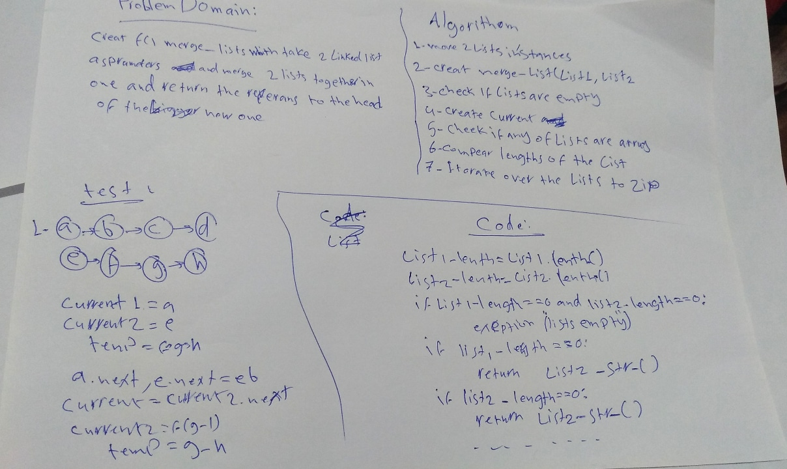
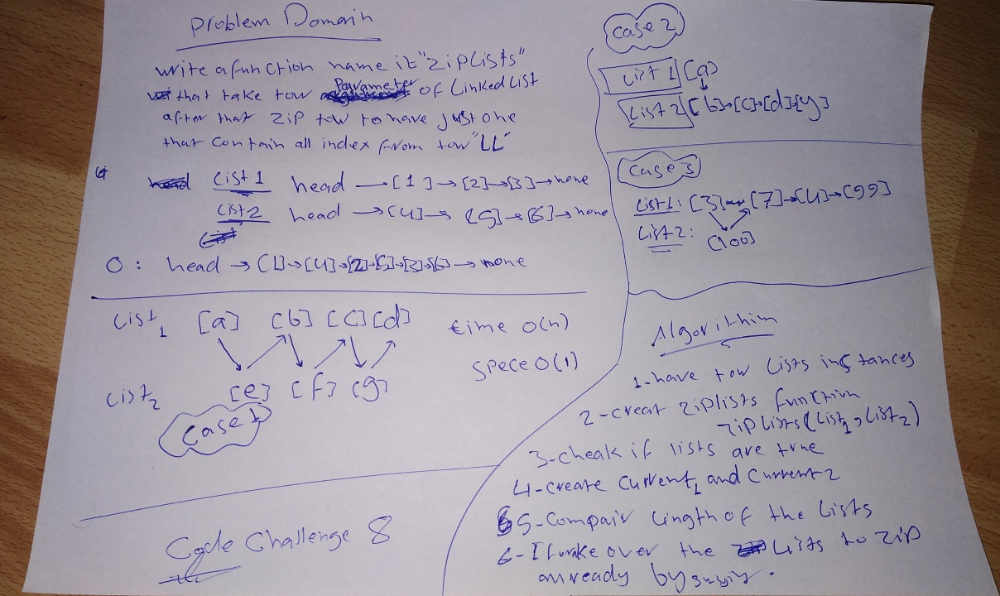

linked_list
create a class and made function to create linked list && add new method like insert && append && insertAfter && insertBefore and more.

Challenge
Create a brand new PseudoQueue class. This PseudoQueue class will implement our standard queue interface (enqueue(value), dequeue()), but will internally only utilize 2 Stack objects.

Approach & Efficiency
init(self, stack1) - initialization of the PseudoQueue class with the 1 given Stack and 1 empty Stack enqueue(value) - Method to inserts value into the PseudoQueue, using a first-in, first-out approach. dequeue() - Method to extract a value from the PseudoQueue, using a first-in, first-out approach. Returns value of extracted node
________________

